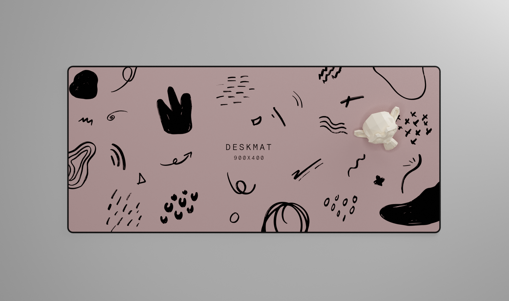

# 900x400mm Deskmat

First up, let me preface this by saying... I am a total novice at anything 3D let alone rendering. At this point i've been using Fusion for maybe 2 weeks and Blender for just over a month so don't take anything i'm saying as being "the correct way". These methods work for me but your mileage may vary.

That being said, enjoy the files and if you want to update them in anyway at all, please feel free to submit PR's.

---

- [Using Blender](./Blender/README.md)
- [Using STL's](./STL/README.md)
- [Using the FBX](./FBX/README.md)
- [Using the Materials](./Materials/README.md)

There are also some STEP files in here too if you fancy those instead 👍

---

## Credits:

Big thanks to the [Keycap Designers Discord](https://discord.gg/8MG4jWK) Discord server for the help with the deskmat shaders (specifically R☭Z, Papi and Swishy). Head on over there if you've got any interest whatsoever in the rendering of keysets, boards or anything related.

There's plenty more qualified/experienced people on that server to explain this stuff better than myself 😆

---

### Contact 👋

Feel free to contact me in any way you fancy... Always interested in chatting with people.

- Discord (prkns#7101)
- Twitter [@perki](https://twitter.com/perki)
- Email (david@prkns.me)
